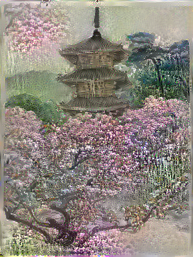

# Artwork with Generative AI

Here are examples of artwork that I have generated by using the style transfer capabilities from TensorFlow, found [here](https://github.com/tensorflow/docs/blob/master/site/en/tutorials/generative/style_transfer.ipynb). I give full attribution to the artists, and this art is not being used for commercial or political purposes. Copies of the original style and content files can be found in the assets folder of this repo. 

## Nighthawks to Nightstand

I have taken Edward Hopper's iconic *Nighthawks* and transferred its style to an image of my nightstand, creating a stylized still life of a woman's dressing table. 

## Impermanent Structures

Using traditional Japanese painting as the subject, I created a more colorful and dream-like version by transferring a digital photograph of a tree in blossom. 

